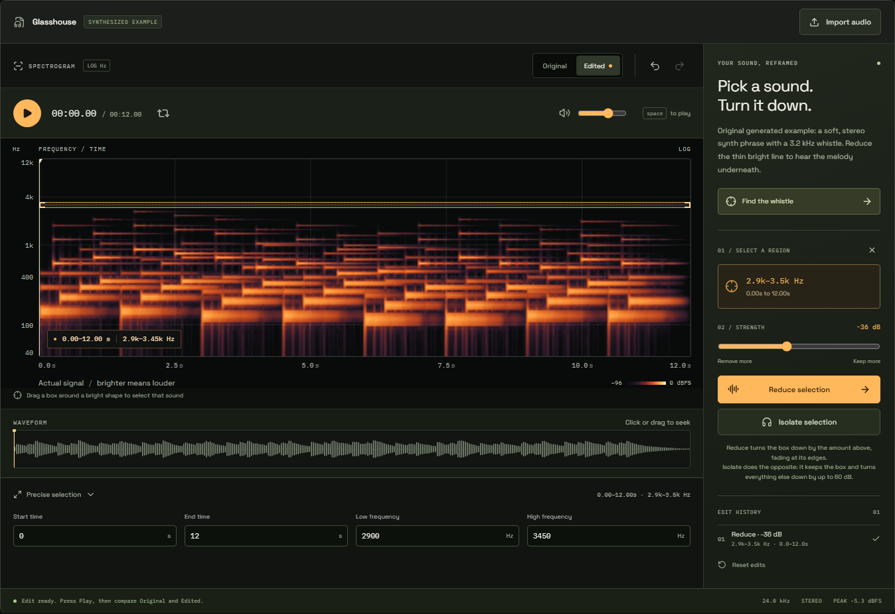
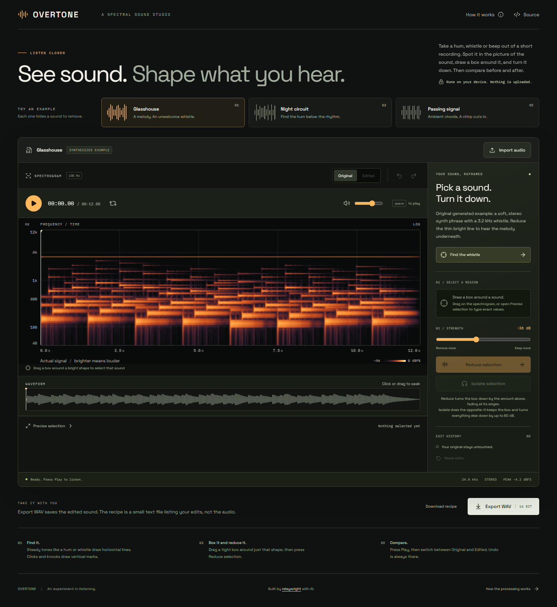
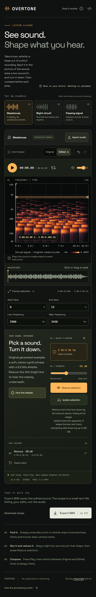

# OVERTONE

**See sound. Shape what you hear.**

A spectral sound studio that runs entirely in your browser. Draw a region on a sound's spectrogram, reduce or isolate it, and hear your edit against the original. Import a short recording or start with one of three original synthesized examples.

[Open the studio](https://relaywright.github.io/overtone/) · [How the processing works](docs/methodology.md) · [Research and references](docs/research.md)



Under the surface: a custom radix-2 FFT, normalized overlap-add reconstruction, and a background worker that renders real audio before redrawing the spectrum. Tests measure the exported signal, including frequency attenuation and exact undo restoration. [Explore the architecture](docs/architecture.md) · [Release verification](docs/verification.md).

<details>
<summary>Full desktop and phone views</summary>





</details>

## Try it in thirty seconds

1. Press **Play** to hear the default example.
2. Choose **Find the whistle** to select the narrow tone visible in the spectrogram.
3. Choose **Reduce selection**, then switch between **Original** and **Edited** while listening.
4. Drag another region or adjust its time and frequency boundaries. Export your edited sound with **Export WAV**.

All three demos are generated examples, not field recordings. The spectrogram and waveform are calculated from the audio you hear.

## What it does

- Local audio import with browser-supported decoding. No account, server processing, API key, or audio upload.
- A logarithmic frequency display with pointer selection and equivalent labeled numeric controls.
- Feathered time/frequency masks for attenuation and isolation.
- Non-destructive edits, undo, redo, reset, and synchronized original/edited comparison.
- Playback, seeking, looping, and output volume.
- Stereo-preserving 16-bit PCM WAV export and a downloadable JSON edit recipe.
- Audio processing in a Web Worker, separate from the interface thread.
- Responsive layout, keyboard controls, and reduced-motion support.

This is an instrument for short clips and deliberate edits. It does not identify speakers, separate instruments, or recover missing audio. Sounds occupying the same time and frequency are affected together. [Read the limitations](docs/methodology.md#limits-and-tradeoffs).

## Run locally

Use Node.js 24 and npm. These commands work in PowerShell, macOS, and Linux shells.

```sh
npm ci
npm run dev
```

Open [localhost:4186/overtone/](http://localhost:4186/overtone/). There are no environment variables or credentials to configure. Fonts are bundled with the application.

## Verify a change

```sh
npm test
npm run build
npx playwright install chromium
npm run test:e2e
```

The browser tests start a preview of the production build on port 4186. They cover desktop and mobile-sized Chromium, audio import, editing and history, comparison playback, downloads, keyboard access, overflow, and automated accessibility checks. Unit tests exercise the signal-processing engine and WAV encoding. Automated accessibility checks supplement manual review; they do not establish universal accessibility or audio quality.

To test an already hosted build in PowerShell:

```powershell
$env:PLAYWRIGHT_BASE_URL = 'https://relaywright.github.io/overtone/'
npm run test:e2e
Remove-Item Env:PLAYWRIGHT_BASE_URL
```

## Inside the project

| Area                   | Responsibility                                                                                   |
| ---------------------- | ------------------------------------------------------------------------------------------------ |
| `src/audio/`           | FFT, spectral analysis and editing, synthesized examples, WAV encoding, and worker communication |
| `src/components/`      | Interactive sound visualizations                                                                 |
| `src/App.tsx`          | Studio state, playback, file handling, and controls                                              |
| `tests/studio.spec.ts` | Browser journeys and accessibility checks                                                        |
| `docs/methodology.md`  | Processing contract, mathematics, and limitations                                                |

The core edit path is deterministic: decoded samples and a list of region edits produce the rendered samples. Each render starts from the original. No model or remote service participates in audio processing.

## Deployment

The repository's GitHub Actions workflow tests and builds each pull request. A successful push to `main` also publishes `dist/` to GitHub Pages. In the repository settings, select **Pages → Build and deployment → GitHub Actions**. The Vite base path is `/overtone/`; change it if deploying under a different repository name or path.

## License and attribution

OVERTONE's original code and synthesized demos are available under the [MIT license](LICENSE). Fonts and dependencies retain their own licenses; see [third-party notices](THIRD_PARTY_NOTICES.md). Imported recordings remain yours and are held in browser memory for the session.

Built with AI-assisted development. The implementation, methodology, tests, and deployment workflow are public so the result can be inspected and reproduced.
