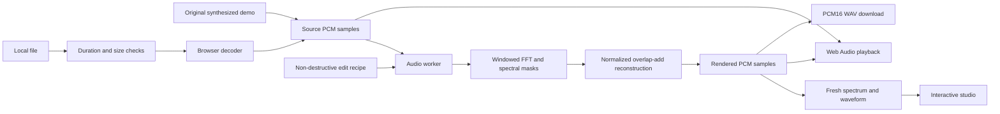

# The signal path

OVERTONE is a static application. Its only remote requests load its own code, fonts, and icons. Imported recordings never leave the device.

## State that must agree

Each worker request has a monotonically increasing identifier. Only the current request can publish a result to the interface. A failed render rolls the visible edit history and recipe back to the last successful render. A processor crash invalidates the pending request, clears output controls, and offers a fresh worker restart.

File decoding has a separate pending state and generation identifier. Pending imports disable playback, editing, and output downloads. Choosing another example invalidates an older import, so a late decoder cannot replace the user's new choice. Metadata is inspected before allocating the decoded sample buffer, allowing overlong audio to be rejected early.

## Playback is separate from editing

The playback hook owns the audio context, output gain, source node, and transport clock. AudioBufferSourceNodes are single-use, so seeking and comparison create new nodes at the current offset. Changing the comparison view preserves the playhead; changing the source resets it. Output volume changes monitoring gain only.

## Display is evidence, not the operation

The Canvas spectrogram uses logarithmic display bins and a fixed decibel scale. It is recomputed from the reconstructed PCM after each edit. Canvas painting is independent of the advancing playhead, which is a lightweight overlay. Pointer, touch, and numeric selection all describe the same rectangle in seconds and hertz.

## Why these boundaries

- A static deployment eliminates backend accounts, API quotas, secrets, and recording uploads.
- The worker keeps the user interface responsive during numerical processing.
- Procedural examples provide repeatable, original demo material.
- The pure engine can be tested independently of visual rendering and browser sound output.
- Build-time checks and browser journeys gate the public deployment.

See [methodology](methodology.md) for signal-processing details and limitations, and [verification](verification.md) for the release evidence.
